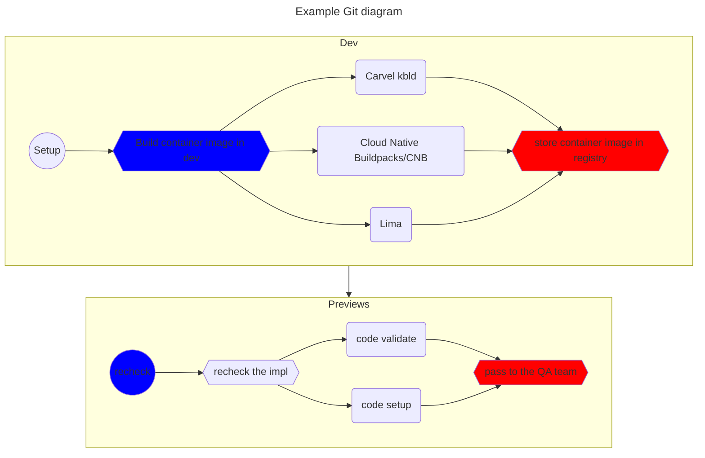

# Mermaid diagram
 

```mermaid
---
title: Example Git diagram
---
flowchart TD;
    setup-dev((Setup))
    subgraph Dev
        bci{{Build container image in dev}}

        click bci "vfarcic/cncf-demo/blob/main/manuscript/build-container-image/story.md" _blank

        style bci fill:blue

        bci-lima(Lima)
        bci-kbld(Carvel kbld)
        bci-buildpacks(Cloud Native Buildpacks/CNB)

        setup-dev-->bci
        bci-->bci-lima

        bci-->bci-kbld-->registry
        bci-->bci-buildpacks-->registry
        bci-lima-->registry

        registry{{store container image in registry}}

        style registry fill:red
    end

    preview-dev((recheck))
    Dev-->Previews

    subgraph Previews
        pre{{recheck the impl}}

        preview-dev-->pre
        style preview-dev fill:blue

        setup-code(code setup)
        validate(code validate)

        pre-->validate-->pass
        pre-->setup-code-->pass
    

        pass{{pass to the QA team}}
        style pass fill:red

    end
```